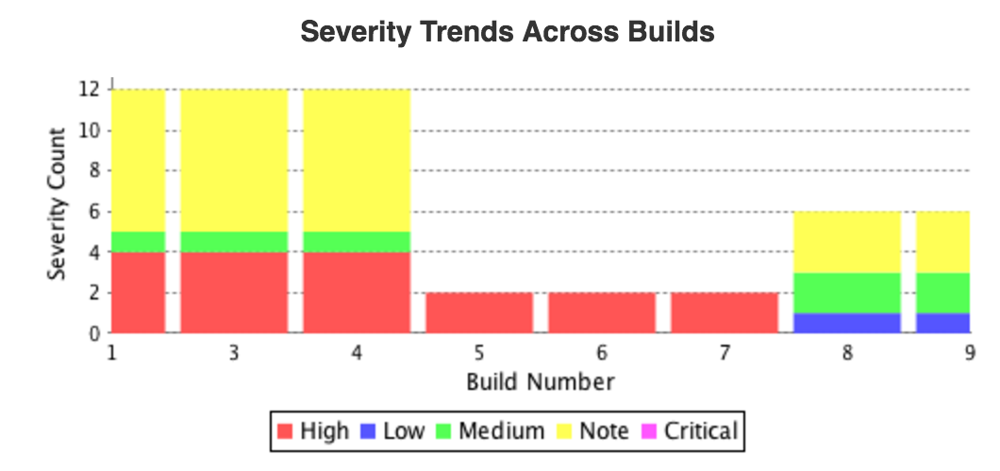
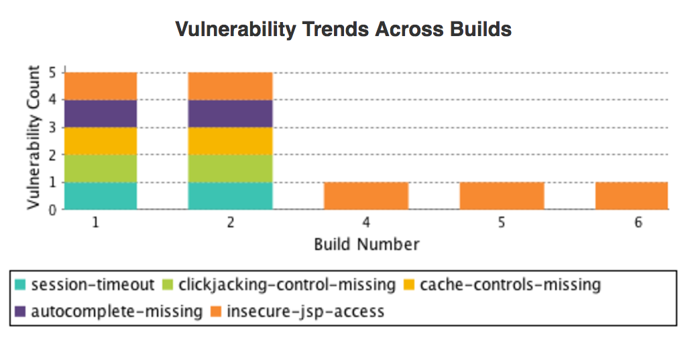

# Contrast Jenkins Plugin

Repository for the Contrast Jenkins plugin. This plugin adds the ability to configure a connection to a Jenkins Build.

## Variables

* `Server Name`                 : TeamServer user's server name; -Dcontrast.server flag passed into your agent. Ex: jenkins.slave1
* `TeamServer Username`         : TeamServer user's username. Ex: test_user@contrastsecurity.com
* `TeamServer Api Key`          : TeamServer user's apiKey; found in Organization settings. Ex: DRiRARqrjG4svdgS2IgcMR08zVn47PBm
* `TeamServer Service Key`      : TeamServer user's serviceKey; found in Organization settings. Ex: UG5C9G5VI6VKSG7E
* `TeamServer Org Uuid`         : TeamServer user's orgUUid; found in Organization settings. Ex: 110a6669-82fb-4db3-8ad2-fef35b01371c
* `TeamServer Url`              : TeamServer Api URL; **Note**: this must be an api url and include `/api` at the end. Ex: 'http://app.contrastsecurity.com/Contrast/api'
* `TeamServer Application Name` : Name of application in TeamServer. -Dcontrast.appname flag passed into your agent. Ex: WebGoat

## Workflow

There are currently 2 build items added by this plugin:

* #### Test TeamServer Connection

    This will verify the Jenkins can connect to TeamServer with the configured variables. It will fail the build if the plugin is unable to connect. This test can be found as a button when adding a TeamServer profile.

* #### Verify Vulnerability Threshold 

    This will check TeamServer for the number of vulnerabilities in the application. The only required variable is `Threshold Count` which must be a positive integer. The other two variables `Threshold Severity` and `Threshold Vulnerability Type` are not required but can be useful if you want to filter the threshold count.
    
    **NOTE:** The variables in the Threshold Condition form are required to run this build action.
    
    This action is a post-build action and will fail the Jenkins build even if your build ran successfully.
    
## Charts

There are 2 charts that are generated after each build `Vulnerability Trends Across Builds` and `Severity Trends Across Builds`.

Here are two examples of the charts:

