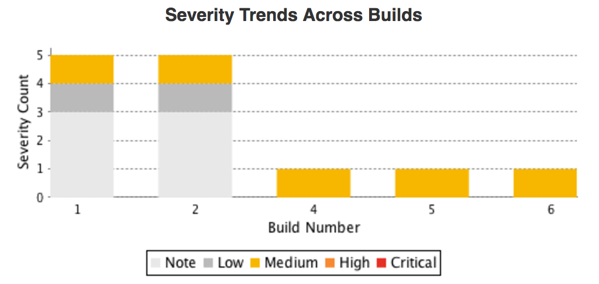

<!--Jenkins Cat -->

# Contrast Jenkins Plugin

Repository for the Contrast Jenkins plugin. This plugin adds the ability to configure a connection to a Jenkins Build.

## Requirements
* Jenkins version >= 2.60.3
> Note: for Jenkins versions between 1.625.3 and 2.60.3, use plugin version [2.12.1](https://github.com/jenkinsci/contrast-continuous-application-security-plugin/releases/tag/contrast-continuous-application-security-2.12.1)

## Contrast TeamServer Compatible Versions

| Jenkins Plugin Version | Minimum Contrast TeamServer Version |
| :---: | :---: |
| 3.4 | 3.7.6 |
| 3.7 | 3.7.10 |
| 3.8 | 3.8.0 |

## Documentation
[Contrast Docs](https://docs.contrastsecurity.com/en/jenkins.html)

## Charts

There are 2 charts that are generated after each build `Vulnerability Trends Across Builds` and `Severity Trends Across Builds`.

Here are two examples of the charts:

> **Note:** The Vulnerability Report is not supported by the pipeline step and jobs that have applications with overridden Vulnerability Security Controls. Your Contrast admin can override the Vulnerability Security Controls for certain applications using the Job Outcome Policies in Contrast. 

## Exported Configurations

[TeamServer Profile Config](contrastPluginConfig.xml)

[Contrast Vulnerability Security Controls Config](vulnerabilityTrendRecorderConfig.xml)

## Building the plugin

`mvn clean install`

## Running Locally

`./run.sh`

